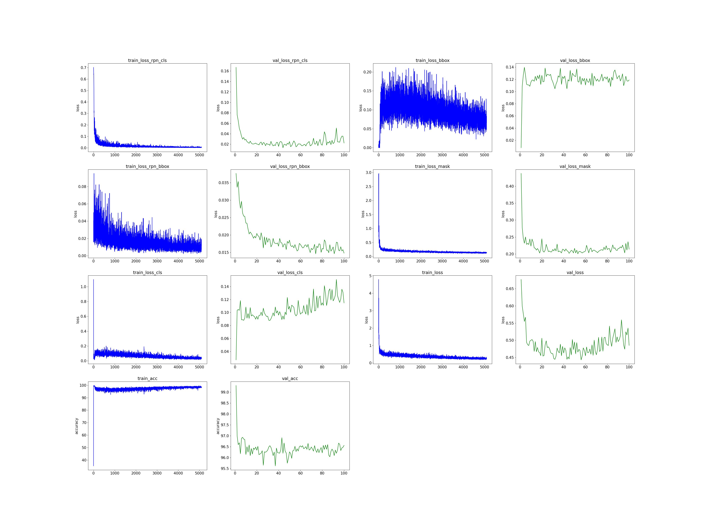
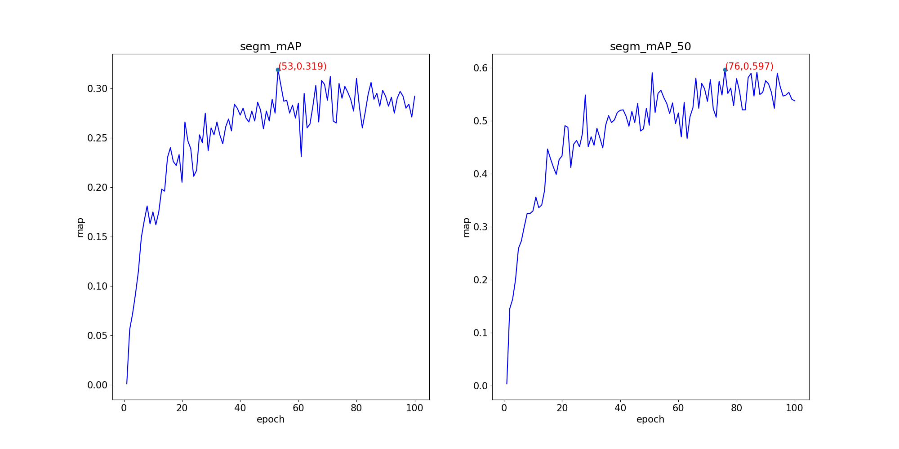
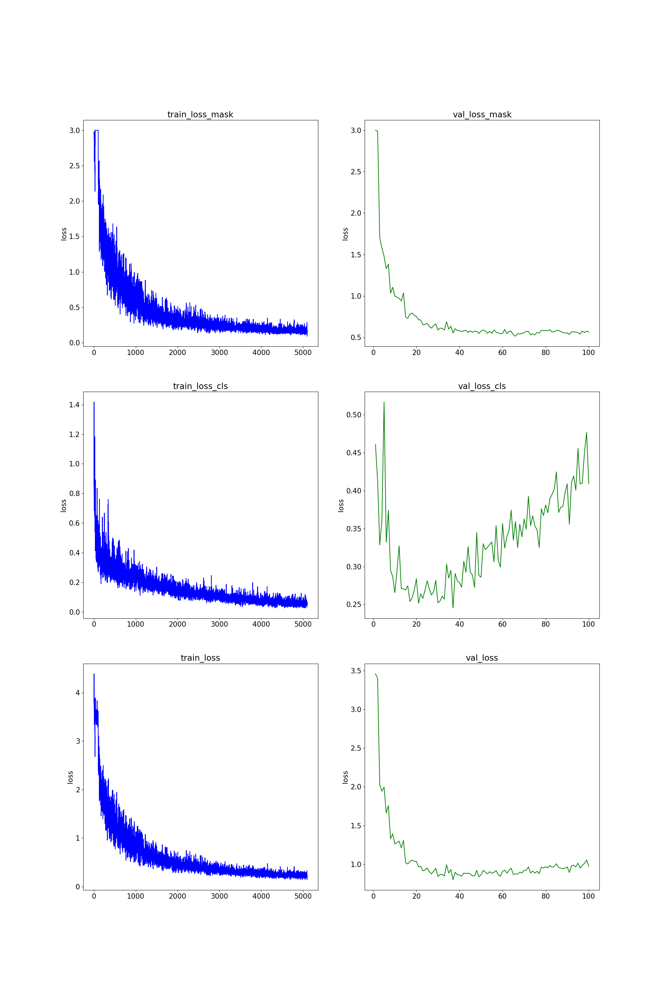
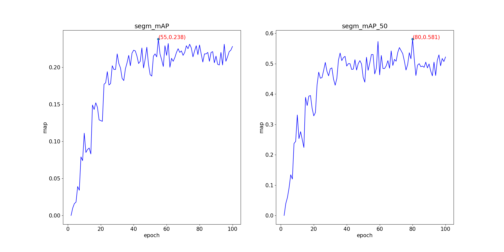
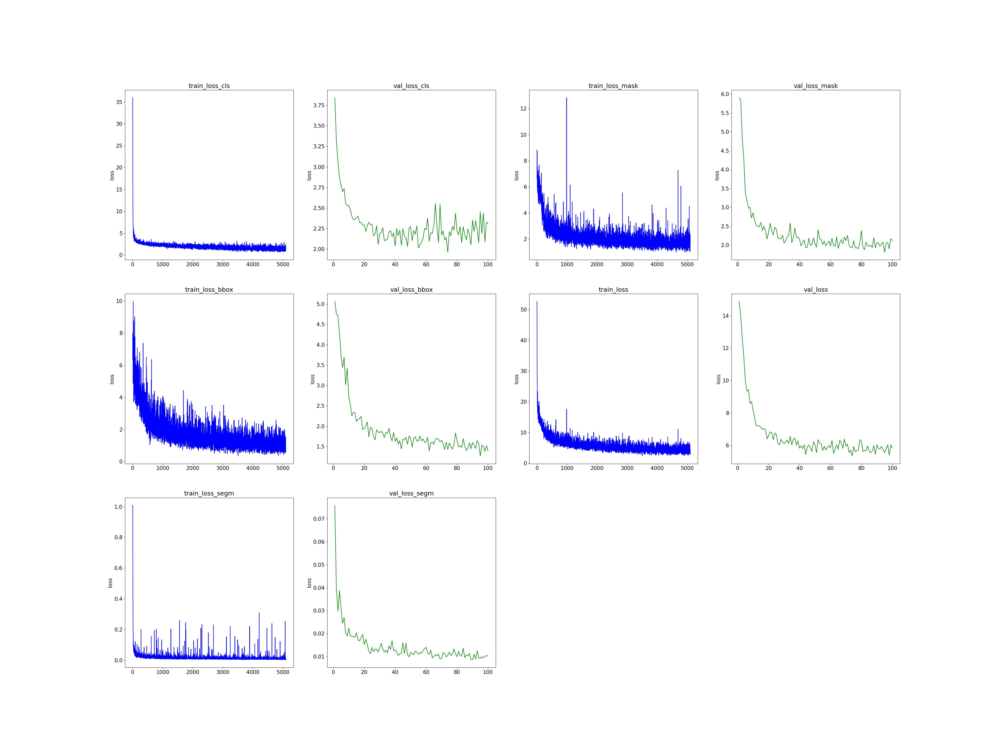
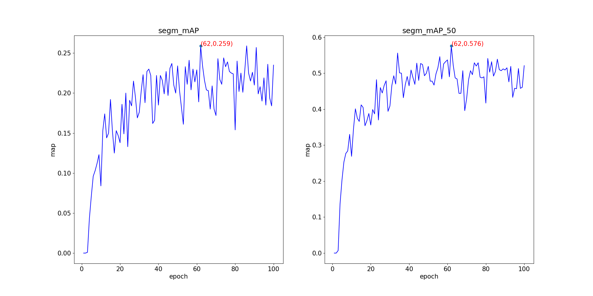

**此文件用于mmdetection的Mask RCNN、SOLOv2、YOLACT模型输出json文件的可视化**

# How to use
## mask_rcnn
```bash
python visualize_maskr_cnn.py
```
## solov2
```bash
python visualize_solov2.py
```
## yolact
```bash
python visualize_yolact.py
```

# Results
## mask_rcnn


## solov2


## yolact



# Based on
https://github.com/xiaoyu1233/mmdetection2.0_visualize
